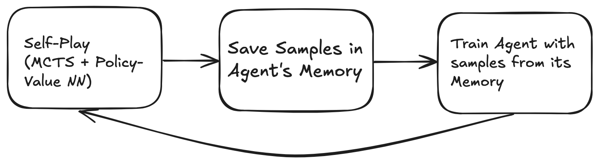
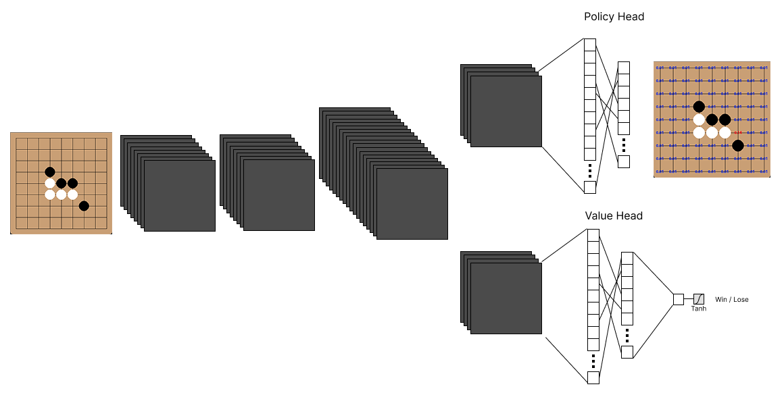

# GomokuRL-Agent 
An AI agent that learns to play **Gomoku** (Five in a Row) using self-play reinforcement learning with Monte Carlo Tree Search (MCTS) and a deep neural network.  

## Overview  
This project was started as a **learning experience** to explore reinforcement learning and self-play methods inspired by DeepMind’s AlphaZero.  
The agent improves entirely through **self-play**, without human data, by combining:  
- **Deep Neural Networks (PyTorch)** for policy (move probabilities) and value (win chance).  
- **Monte Carlo Tree Search (MCTS)** for lookahead search during gameplay.  
- **Reinforcement Learning** from self-play games to iteratively refine the model.  

## Training Pipeline

## How Neural Network is Used  

The neural network plays two key roles in the learning pipeline:  

1. **Guiding Search (during self-play)**  
   - For each game state, the neural network receives the board as input, represented by **three channels**: one for the current player’s stones, one for the opponent’s stones, and one for empty positions.  
   - A **Convolutional Neural Network (CNN)** processes this input to generate a feature representation of the board, which is then passed to two separate heads: the **policy head** and the **value head**.  
   - The network outputs:  
     - **Policy** → a probability distribution over all possible moves.  
     - **Value** → an estimate of the expected game outcome (win, loss, or draw) from the current state.  
   - These outputs guide the **Monte Carlo Tree Search (MCTS)**, focusing the search on the most promising moves and improving decision-making during self-play.

3. **Learning from Experience (during training)**  
   - After a batch of self-play games finishes, the collected samples `(state, policy_distribution_mcts, value_target)` are used to train the network.  
   - The network is optimized with three objectives:  
     - **Policy Loss** → make the predicted policy match the MCTS move distribution.  
     - **Value Loss** → make the predicted value match the actual game result.  
     - **Regularization Term** → prevent overfitting and stabilize learning.  

This creates a feedback loop 🔄:  
- **Better networks** guide **better self-play**.  
- **Better self-play** produces **better training data**.  
- Over time, the agent improves without any human examples.  

[Watch the demo](./images/agent-vs-heuristicMCTS.gif)

Due to limited computational resources (no dedicated GPU), I eventually stopped large-scale training.  
However, even in the early stages of training, I could observe the model **gradually improving its gameplay** through self-play training.  
